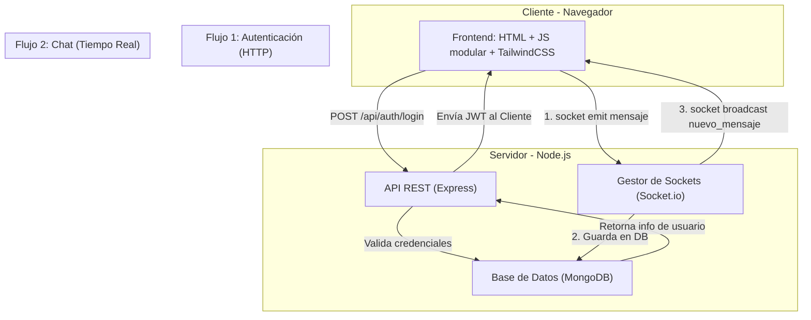
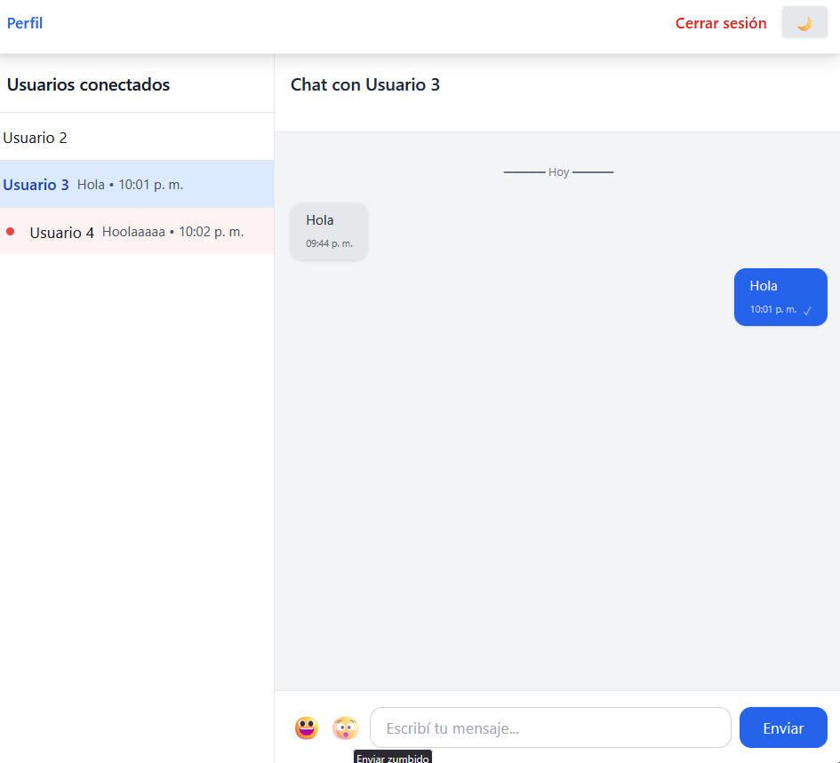
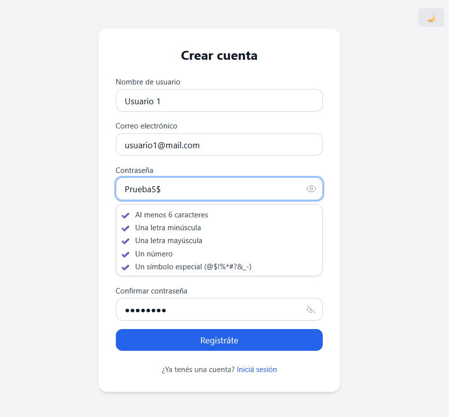
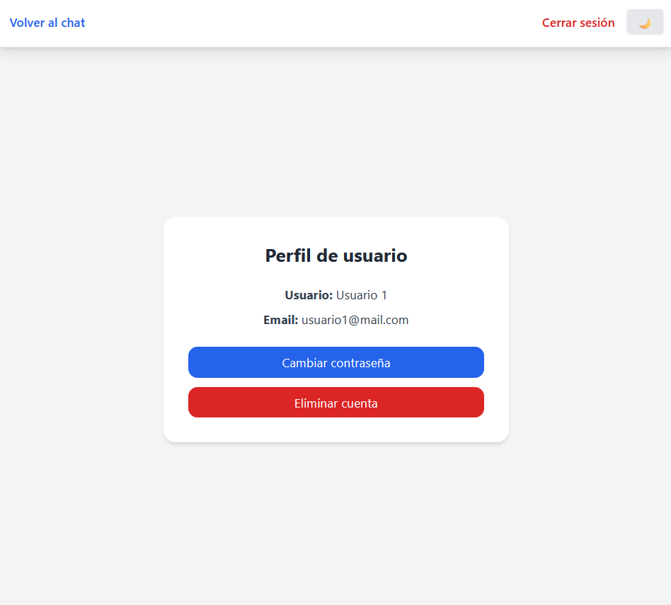
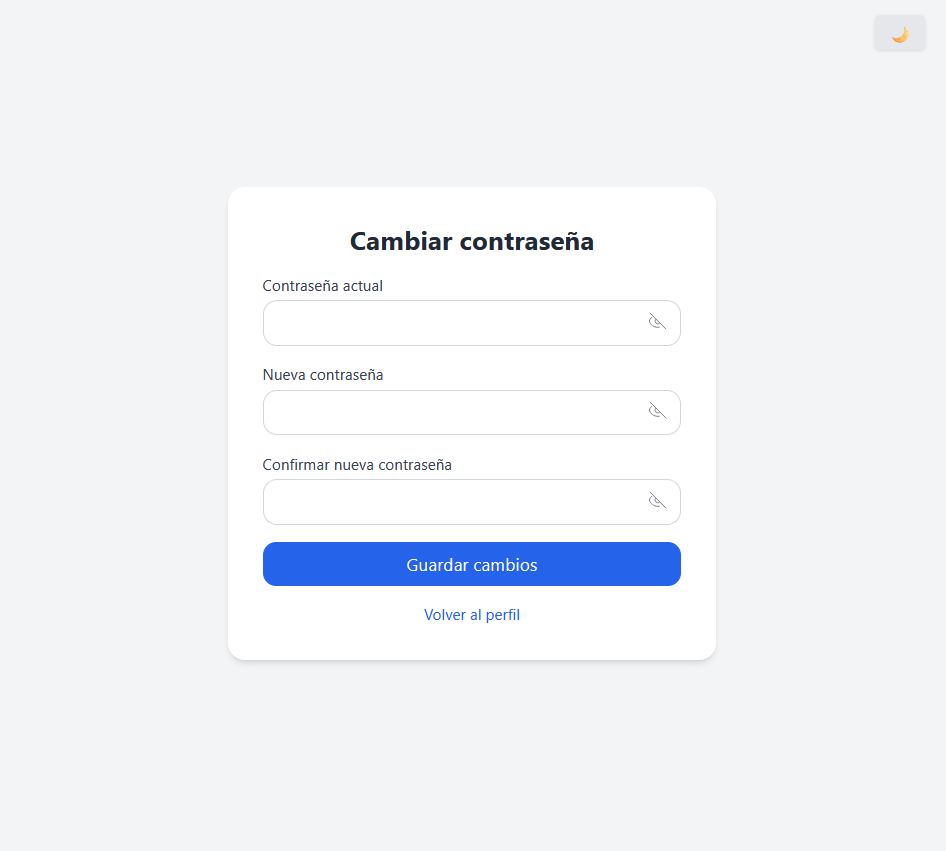
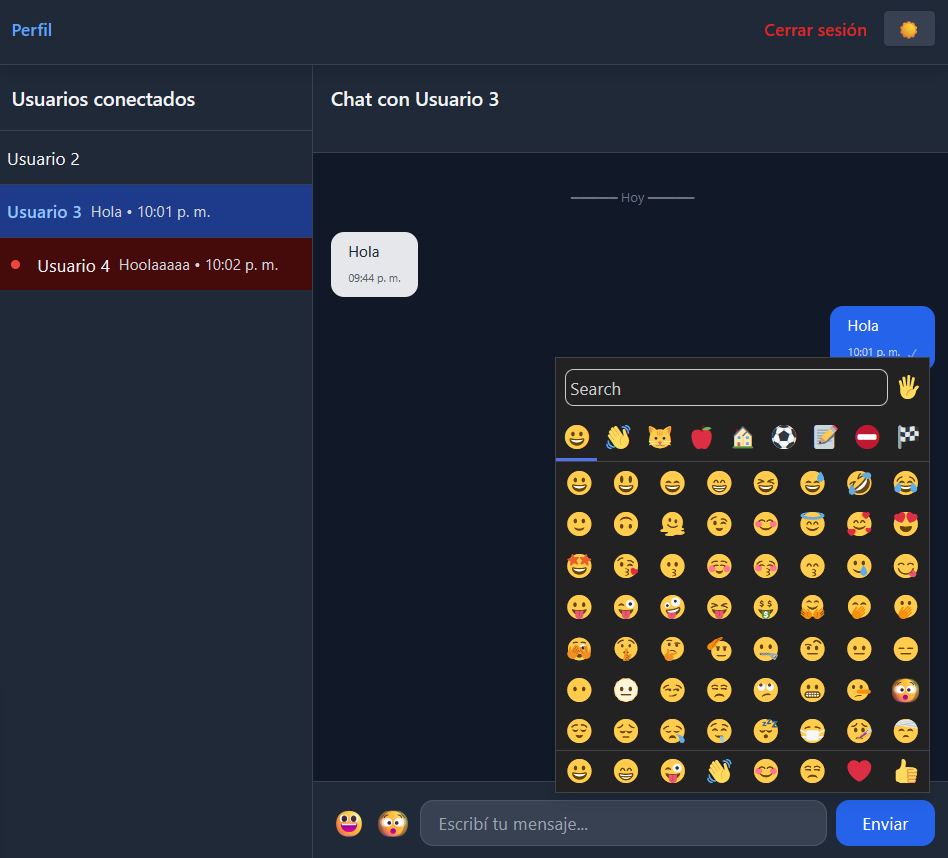
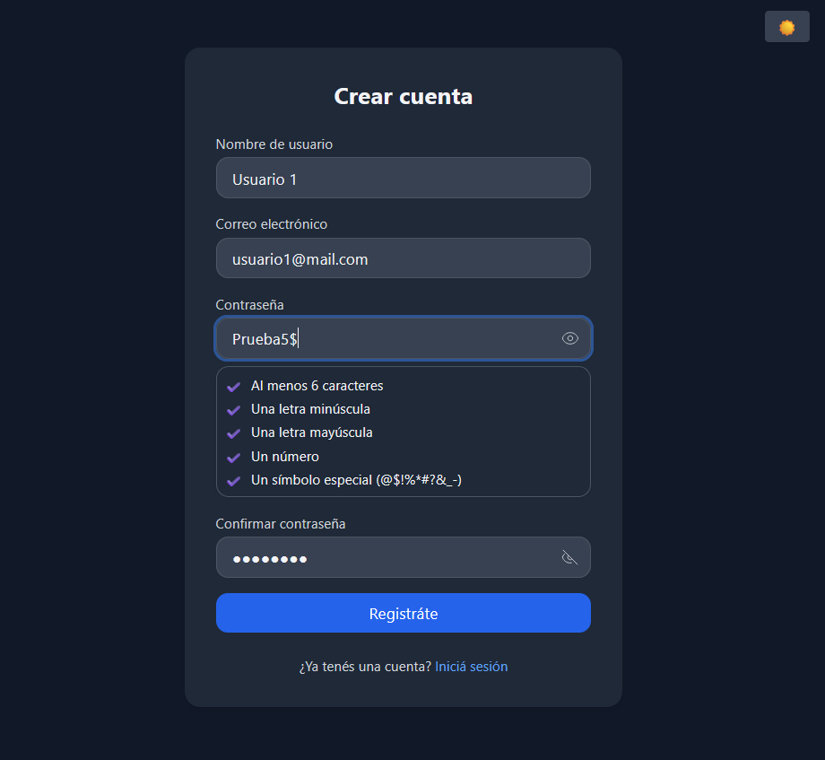
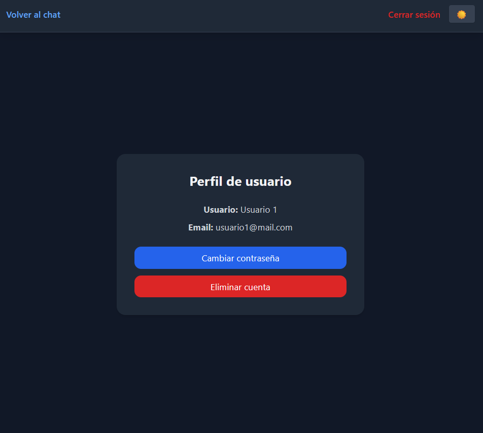
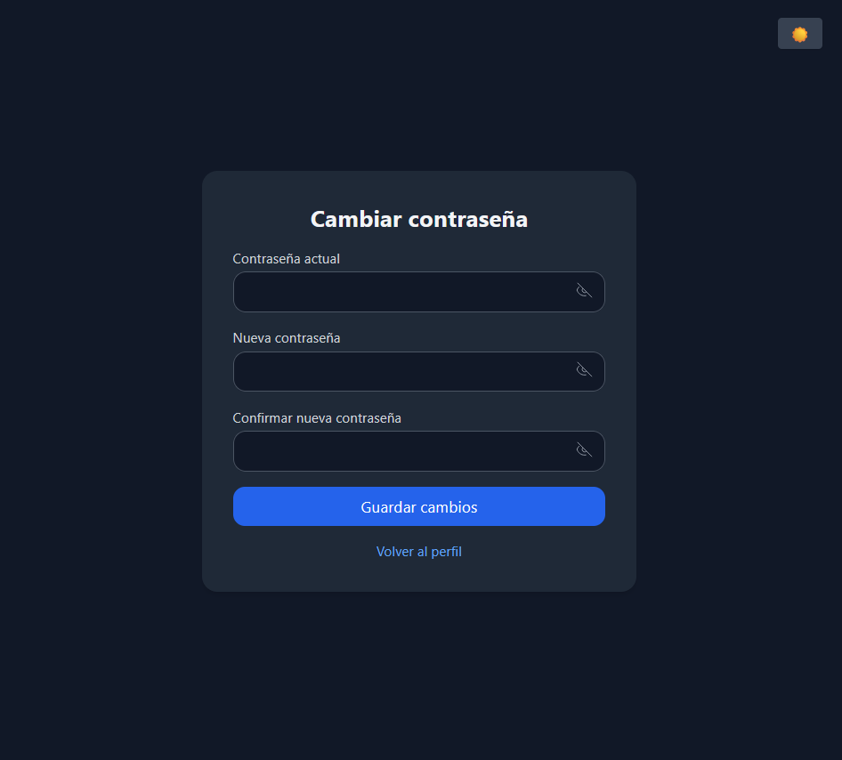

# Sala Chat 💬

**Sala Chat** es una aplicación web de mensajería en tiempo real construida con Node.js, Express, Socket.io y MongoDB en el backend, y HTML, JavaScript (modular ES6) y Tailwind CSS en el frontend.

Este proyecto está dividido en dos carpetas principales:

- `chat-backend/`: API REST + WebSocket (Socket.io)
- `chat-frontend/`: Interfaz de usuario SPA modular con manejo de estados, rutas y comunicación en tiempo real.

---

## 🚀 Funcionalidades principales

- Registro con verificación por correo electrónico.
- Inicio de sesión con JWT.
- Recuperación y restablecimiento de contraseña.
- Chat en tiempo real (¡con zumbido incluido 🔔!).
- Historial de conversaciones.
- Notificación de usuarios conectados/desconectados.
- Cambio entre tema claro y oscuro.
- Perfil de usuario, cambio de contraseña y eliminación de cuenta.

---

# 📐 Diseño y Arquitectura

Este proyecto no es solo una aplicación funcional, sino una **demostración de una arquitectura de software desacoplada**.  
Se compone de un **Frontend (cliente)** y un **Backend (servidor)** que se comunican a través de dos canales distintos:

- **API REST (HTTP):** Para todas las acciones de autenticación y gestión de usuarios *(Registro, Login, Verificación de Email, Perfil)*.  
- **WebSockets (Socket.io):** Para toda la comunicación en tiempo real *(Mensajes de chat, lista de usuarios conectados)*.

---

## 🧩 Diagrama de Arquitectura

El siguiente diagrama ilustra el flujo de la información:



---

# 🗄️ Modelos de Datos (Diseño de BD)

Para dar soporte a las funcionalidades, se diseñaron dos modelos (colecciones) principales en **MongoDB**:

## 1. Colección **Usuarios**

Almacena la información de los usuarios, gestiona la autenticación y la recuperación de contraseñas.

```javascript
// Estructura (tipo Mongoose)
{
  nombre: { type: String, required: true },
  email: { type: String, required: true, unique: true },
  password: { type: String, required: true }, // Contraseña hasheada
  estado: { type: String, default: 'offline' },
  emailToken: { type: String }, // Token para verificación/recuperación
  emailVerified: { type: Boolean, default: false }
}
```

---

## 2. Colección **Mensajes**

Almacena el historial de la conversación de la sala general.

```javascript
// Estructura (tipo Mongoose)
{
  usuario: { 
    type: mongoose.Schema.Types.ObjectId, 
    ref: 'Usuario', 
    required: true 
  },
  mensaje: { type: String, required: true },
  timestamp: { type: Date, default: Date.now }
}
```

---

## 📦 Estructura del proyecto

```
sala-chat/
├── chat-backend/         # Backend con Express y Socket.io
├── chat-frontend/        # Frontend modular con JS nativo y Tailwind
├── .gitignore
├── .gitattributes
├── LICENSE
└── README.md             # Este archivo
```

Cada subcarpeta tiene su propio `README.md` detallado sobre instalación, uso y estructura interna.

---

## 🛠️ Requisitos

- Node.js v18+
- MongoDB Atlas (o local)
- Navegador moderno compatible con ES6 modules

---

## 🧪 Instalación rápida

1. Clonar el repositorio completo:

```bash
git clone https://github.com/tuusuario/sala-chat.git
cd sala-chat
```

2. Instalar dependencias del backend:

```bash
cd chat-backend
npm install
```

3. Crear el archivo `.env` en `chat-backend/` (ver ejemplo en su README).

4. Iniciar el servidor backend:

```bash
npm run dev
```

5. Abrir el frontend:

No se necesita un servidor adicional: simplemente abrí `chat-frontend/index.html` en tu navegador
O bien, usá Live Server (VSCode) o similar para evitar posibles restricciones de CORS.

---

## 🔐 Seguridad

- Las rutas protegidas del backend requieren un token JWT válido.
- Validación visual y funcional de contraseñas seguras en frontend.
- Confirmación de contraseña antes de eliminar una cuenta.

---

## 📸 Vista previa

### Tema Claro






### Tema Oscuro






---

## 👤 Autor

José Augusto Orellana

---

## 📄 Licencia

Este proyecto está licenciado bajo la Licencia MIT.  
Consultá el archivo [LICENSE](./LICENSE) para más información.
